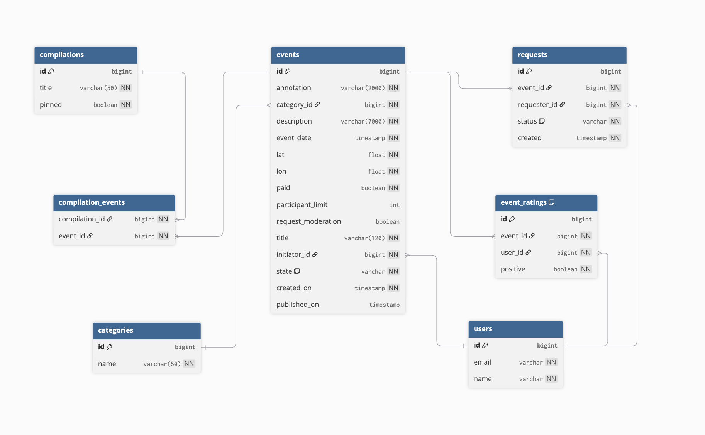
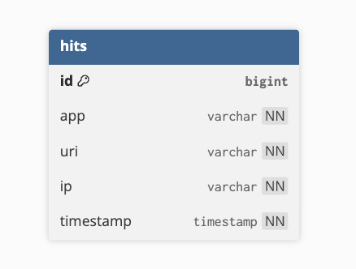

# ExploreWithMe

A Spring Boot event platform where users can create events, invite others,
and manage participation. Built as a multi-module Maven application with
two independent services communicating via REST.

## Architecture

**Main Service** (port 8080) — core business logic:
- Public API: browse published events, categories, compilations
- Private API: create and manage your own events, submit participation requests
- Admin API: moderate events, manage users, categories and compilations
- Feature: rating system — likes/dislikes on events, leaderboards

**Statistics Service** (port 9090) — tracks endpoint hits and provides
view counts used by the main service.

## Tech Stack

- Java 21, Spring Boot 3.3.2
- Spring Data JPA, PostgreSQL
- Docker Compose
- Lombok, MapStruct-style manual mappers
- Checkstyle for code quality

## Database Schema

### Main Service
The main service uses a relational PostgreSQL database with the following tables:
`users`, `categories`, `events`, `requests`, `compilations`, and `event_ratings` (rating feature).

### Statistics Service
A separate PostgreSQL database used exclusively by the stats service to store endpoint hit data.

## API Specs

- [`ewm-main-service-spec.json`](ewm-main-service-spec.json) — main service
- [`ewm-stats-service-spec.json`](ewm-stats-service-spec.json) — stats service
- [`feature-rating-events-spec.json`](feature-rating-events-spec.json) — ratings feature

## Rating Feature

Registered participants can like or dislike events they attended.
Rules:
- Only users with a confirmed participation request can rate
- Event organizers cannot rate their own events
- One rating per user per event (can be changed, not duplicated)
- Events and organizers get a public leaderboard sorted by rating
- Public `/events` endpoint supports `sort=RATING`

## Postman Tests

The `postman/` directory contains a collection for testing the rating feature endpoints.

**Collection:** `postman/feature.json`

**To run:**
1. Import the file into Postman via **File → Import**
2. Make sure the application is running locally on port 8080
3. Open the collection and click **Run** to execute all requests in order

The collection covers the full rating lifecycle: setup (users, categories, events),
happy path (like, dislike, change rating, delete rating), error cases (403, 404, 409),
public leaderboards, and cleanup.

## Pull Request

[feature → main](https://github.com/soulongandgoodnight/java-explore-with-me/pull/4)
